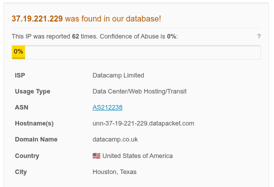

# Incident Response Report: SOC210 - VPN Brute Force Attack
**Incident ID**: SOC210 / EventID 162, **Date of Report**: Dec 26, 2025
**Analyst**: Steven Razanajatovo, **Severity**: High
**Status**: Open (Immediate Action Required), **Verdict**: True Positive

## Executive summary
On June 21, 2023, at 01:51 PM, the SOC received an alert (SOC210) regarding a possible brute force attack on the VPN gateway.

Investigation confirmed that an external IP address (`37.19.221.229`) executed a password spraying/brute force attack against the VPN interface (`33.33.33.3`3). The attacker attempted multiple logins using non-existent usernames and incorrect passwords before successfully compromising the account `mane@letsdefend.io`. This is a confirmed True Positive with successful unauthorized access.

## Incident overview
- **Alert Rule**: SOC210 - Possible Brute Force Detected on VPN

- **Event Time**: Jun 21, 2023, 01:51 PM

- **Source Address**: `37.19.221.229`

- **Destination Address:** `33.33.33.33`(VPN Gateway)

- **Compromised Account:** `mane@letsdefend.io`

## Investigation timeline & analysis
### Source analysis
- **IP Reputation**: The source IP `37.19.221.229` (US) has been reported 62 times in [AbuseIPDB](https://www.abuseipdb.com/check/37.19.221.229) for malicious activities, including Brute Force, DDoS, and Bad Web Bot behavior.

- **Attack Pattern**: The L1 analysis noted the same IP address attempting to log in for different users, indicating a "Password Spraying" or dictionary attack methodology.

### Authentication log analysis
Log management for the source IP revealed a clear sequence of brute force attempts culminating in a breach.

- **Total Attempts**: 10 login attempts targeted the VPN port 443.

- **Invalid Usernames**: 4 attempts used non-existent usernames, suggesting the attacker was enumerating valid accounts.

- **Password Guessing**: 5 failed attempts targeted `mane@letsdefend.io`with incorrect passwords.

- **Successful Compromise**: At 01:51 PM, the attacker successfully logged in as `mane@letsdefend.io`.

## Indicators of Compromise (IoCs)
The following artifacts identify the attacker and should be blocked.
| Type  | Value  | Context  |
|---|---|---|
| Source IP  | `37.19.221.229`  | Attacker IP (Brute Force Source)  |
| Compromised user  | `mane@letsdefend.io`  | Account Successfully Breached  |
| Target service  | 33.33.33.33:443  | VPN Gateway  |

## Containment & remediation
- **Account Lockdown**: Immediately disable the account `mane@letsdefend.io` to revoke the attacker's active session.

- **Session Termination**: Force terminate any active VPN sessions associated with the user or the source IP.

- **Blocking**: Block IP `37.19.221.229` at the perimeter firewall.

- **Credential Reset**: Force a password reset for `mane@letsdefend.io` and ensure Multi-Factor Authentication (MFA) is enabled and re-enrolled if necessary.

## Recommendations & lessons learned
1. **Rate Limiting**: Implement stricter account lockout policies (e.g., lock after 3-5 failed attempts) to prevent brute force success.

- **Error Message Hardening**: Configure the authentication system to return generic error messages (e.g., "Invalid Login") rather than specifying whether the username or password was incorrect, to prevent username enumeration.

- **Geo-Blocking**: If the organization does not have legitimate business in the US region (or specific ASN), consider geo-blocking or restricting VPN access to known user locations.