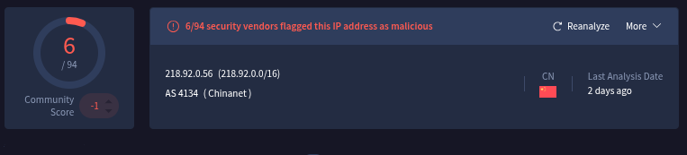
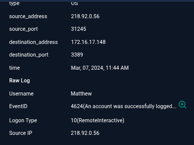

# Incident Response Report: SOC176 - RDP Brute Force Attack
> **Incident ID**: SOC176 / EventID 234, **Date of Report**: "Jan 09, 2026", 
**Analyst**: Steven Razanajatovo, **Severity**: High, 
**Status**: Open (Immediate Action Required), **Verdict**: True Positive

## Executive summary
On March 07, 2024, at 11:44 AM, the SOC received an alert (SOC176) regarding an RDP Brute Force attack targeting the endpoint "**Matthew**" (172.16.17.148).

Investigation confirmed that an external IP address (`218.92.0.56`) executed a series of RDP login attempts. After 14 failed attempts using various non-existent usernames, the attacker successfully brute-forced the password for the valid user account "**Matthew**" and established a successful RDP session. The incident is classified as a True Positive unauthorized access event requiring immediate host isolation.

## Incident overview
- **Alert Rule**: SOC176 - RDP Brute Force Detected

- **Event Time**: Mar 07, 2024, 11:44 AM

- **Target Host**: Matthew (172.16.17.148)

- **Source IP**: `218.92.0.56`

- **Protocol**: RDP (Port 3389)

- **Trigger Reason**: Login failure from a single source with different non-existing accounts

## Investifation timeline & analysis
### Source analysis
- **Attacker IP**: `218.92.0.56`(China).

- **Reputation**: The IP is highly malicious, with 6/94 detections on VirusTotal and over 450,000 reports on AbuseIPDB, primarily associated with brute-force attacks.

### 3.2. Attack Pattern (Brute force)
Log analysis revealed a clear "password spraying" or brute force pattern targeting the Remote Desktop Protocol.

- **Failure Phase**: The attacker made 14 consecutive failed login attempts, often guessing non-existent usernames (Event ID 4625).

- **Success Phase**: At 11:44 AM, the attacker correctly guessed the credentials for the user "Matthew," resulting in a successful login (Event ID 4624).

### Impact & lateral movement
- **Compromise Confirmed**: The presence of Event ID 4624 (Successful Logon) linked to the malicious IP confirms the host was breached.

- **Lateral Movement Check**: Initial filtering of log management for the attacker's IP showed no immediate connections to other servers from this specific IP, suggesting the attack was currently contained to the "Matthew" endpoint.

## Indicators of Compromise (IOCs)
The following artifacts identify the attacker and the compromised account.
| Type  | Value  | Context  |
|---|---|---|
| **Source IP**  | `218.92.0.56`  | Brute Force Source  |
|  **Compromised User** | `Matthew`  | Account breached  |
| Port  | 3389  | Targeted Service (RDP)  |

## Containment & remediation
- **Immediate Isolation**: The device "Matthew" (172.16.17.148) must be isolated from the network to terminate the active RDP session and prevent data exfiltration.

- **Account Lockdown**: Disable the user account "Matthew" and force a password reset.

- **Session Termination**: Kick any active RDP sessions for the user.

- **Blocking**: Block the IP `218.92.0.56` at the firewall.

## Recommendations
1. **Disable External RDP**: Remote Desktop Protocol (port 3389) should never be directly exposed to the internet. Access should be restricted to VPN users only.

2. **MFA Implementation**: Enforce Multi-Factor Authentication (MFA) for all remote access to prevent credential stuffing/brute force attacks from succeeding even if the password is compromised.

3. **Account Lockout Policy**: Strengthen the account lockout policy to trigger after 3-5 failed attempts, which would have stopped this attack before the 14th attempt.