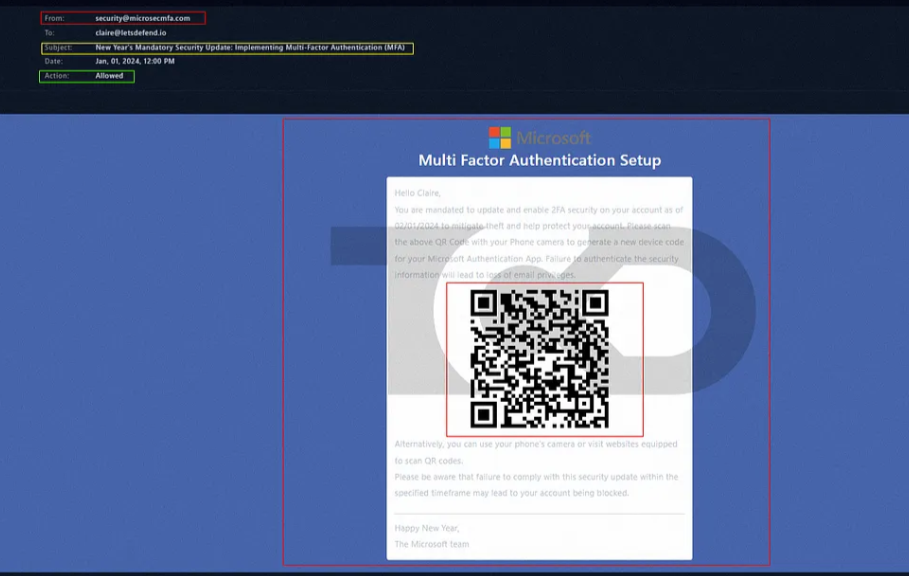
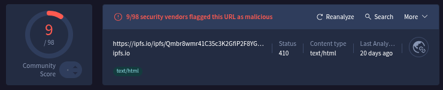
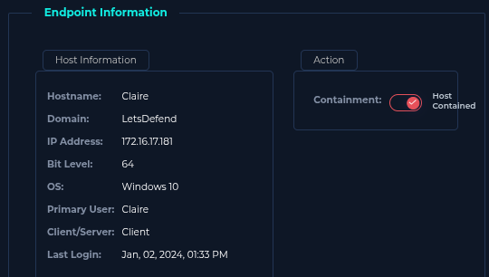

# Incident Response Report: SOC282 - Phishing Alert
**Incident ID**:SOC251 / EventID 214, **Date of Report**: "Dec 31, 2025", 
**Analyst**: Steven Razanajatovo, **Severity**: High,
**Status**: Closed, **Verdict**: True Positive

## Executive summary
On January 01, 2024, the SOC detected a phishing attempt targeting the user "**Claire**" (`Claire@letsdefend.io`) using a "Quishing" (QR Code Phishing) technique.

The attacker sent an email masquerading as a mandatory security update for Multi-Factor Authentication (MFA). The email bypassed standard link filters by embedding the malicious payload within a QR code. Upon analysis, the QR code redirected to a malicious URL hosted on the IPFS network (`ipfs.io`). The incident is classified as a True Positive phishing attempt.

## Incident overview
- **Alert Rule**: SOC251 - Quishing Detected (QR Code Phishing)

- **Event Time**: Jan 01, 2024, 12:37 PM

- **Recipient**: `Claire@letsdefend.io`

- **Sender**: `security@microsecmfa.com` (Spoofed/Malicious)

- **Subject**: "New Year's Mandatory Security Update: Implementing Multi-Factor Authentication (MFA)"

## Investigation timeline & analysis
### Email & Header Analysis
The email utilized a high-pressure lure ("Mandatory Security Update") regarding MFA implementation.

- **Sender IP**: `158.69.201.47` (Located in Canada).

- **Reputation**: The sender IP is flagged as malicious by 8/95 vendors on VirusTotal, specifically for phishing.

### QR Code Payload (Quishing)
The email body contained no text-based malicious links, relying instead on a QR code to evade text-based filters.

- **Decoded URL**: `https://ipfs.io/ipfs/Qmbr8wmr41C35c3K2GfiP2F8YGzLhYpKpb4K66KU6mLmL4#`.

- **Hosting Technique**: The attacker abused the InterPlanetary File System (IPFS) to host the phishing page, a technique often used to bypass domain reputation blocks.

- **Reputation Check**: The URL was flagged as malicious by 9/98 vendors on VirusTotal. The hosting IP `209.94.90.1` was also flagged as malicious.

### Target identification
- **User IP**: 172.16.17.181.

- **Containment**: The user's endpoint was identified for isolation to ensure they did not scan the code on a mobile device connected to the corporate Wi-Fi.

## Indicators of Compromise (IOCs)
The following artifacts were identified for blocking.
|  Type | Value  |
|---|---|
|  Sender Address | `security@microsecmfa.com`  |
| Sender IP  | `158.69.201.47`  |
|  URL | `https://ipfs.io/ipfs/Qmbr8wmr41C35c3K2GfiP2F8YGzLhYpKpb4K66KU6mLmL4#`  |
| Hosting IP  |  `209.94.90.1` |

## Containment & remediation
- **Email Purge**: Deleted the malicious email from Claire's inbox and searched for the same subject line across the organization.

- **Blocking**: Blocked the domain `microsecmfa.com` and the sender IP `158.69.201.47`.

- **User Alert**: Notified the user "Claire" not to scan the code or enter credentials if they had already done so on a personal device.

## Recommendations
1. **Mobile Security**: Since QR codes are typically scanned by mobile devices (often bypassing corporate endpoint protection), emphasize the risks of scanning codes from unsolicited emails in user training.

2. **Image Analysis**: Consider deploying email security solutions capable of OCR (Optical Character Recognition) to decode and inspect QR codes within email bodies.