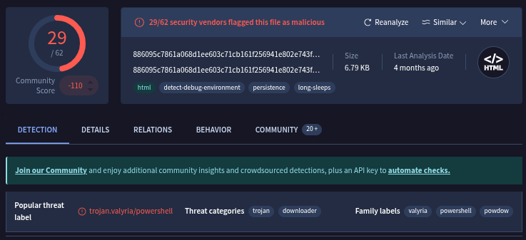
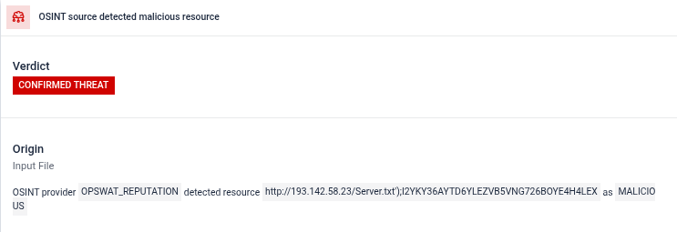

# Incident Response Report: SOC164 - Suspicious Mshta Behavior (LOLBin)
**Incident ID**: SOC164 / EventID 114, **Date of Report**: "Dec 31, 2025", 
**Analyst**: Steven Razanajatovo, **Severity**: High, 
**Status**: Closed, **Verdict**: True Positive

## Executive summary
On March 05, 2022, the SOC detected suspicious execution of the "Living off the Land" binary (LOLBin) `mshta.exe` on the endpoint "**Roberto**" (172.16.17.38).

Investigation confirmed that the user executed a malicious HTML Application file (`Ps1.hta`) located on the Desktop. This file is a known Trojan downloader (Valyria/Powdow) designed to execute malicious VBScript and attempt to download secondary payloads from an external C2 server (`193.142.58.23`). The activity was initially **Allowed** by the EDR, requiring immediate remediation.

## Incident overview
- **Alert Rule**: SOC164 - Suspicious Mshta Behavior

- **Event Time**: Mar 05, 2022, 10:29 AM

- **Hostname**: Roberto

- **IP Address**: 172.16.17.38

- **Binary Path**: C:/Windows/System32/mshta.exe

- **Trigger Reason**: Low reputation hta file executed via mshta.exe

## Investigation timeline & analysis
### Execution analysis
The alert was triggered by the command line execution: `C:/Windows/System32/mshta.exe C:/Users/Roberto/Desktop/Ps1.hta`

- **Technique**: The attacker used `mshta.exe`, a legitimate Windows system utility, to execute malicious code contained within `Ps1.hta`. This technique is used to bypass application whitelisting.

### Malware analysis
- **File Name**: `Ps1.hta`

- **MD5**: `6685c433705f558c5535789234db0e5a`

- **Reputation**: VirusTotal analysis flagged the file as malicious (29/62 vendors), categorizing it as a VBScript Trojan and Downloader (Families: Valyria, Powdow).

### Network indicators
Further analysis revealed the script attempts to contact an external server to download a payload.

- **C2 URL**: `http[:]//193.142.58.23/Server.txt`

- **Behavior**: The script likely attempts to download `Server.txt` (containing further malicious instructions or PowerShell code) and execute it on the victim machine.

## Indicators of Compromise (IOCs)
The following artifacts were identified and should be added to the organization's blocklists.
| Type  | Value  | Context  |
|---|---|---|
| File HASH (MD5)  | `6685c433705f558c5535789234db0e5a`  | Malicious HTA File  |
| IP Address  |  `193.142.58.23` |  C2 / Download Server |
| URL  | `http://193.142.58.23/Server.txt`  | Payload URL  |
| File name  | Ps1.hta  | Dropper File  |

## Containment & remediation
- **Isolation**: Isolate the host "Roberto" (172.16.17.38) to prevent the downloaded payload from executing or spreading.

- **Process Termination**: Kill any active `mshta.exe` processes spawned from the desktop.

- **File Removal**: Delete `C:/Users/Roberto/Desktop/Ps1.hta`.

- **Blocking**: Block IP `193.142.58.23` at the firewall.

## Recommendations
1. **Attack Surface Reduction**: Associate `.hta` files with `notepad.exe` instead of mshta.exe via Group Policy (GPO) to prevent double-click execution, or block `mshta.exe` execution if not required for business operations.

2. **User Training**: Educate users on the danger of downloading and running unknown script files (like `.hta`, `.js`, `.vbs`) from email or the web.