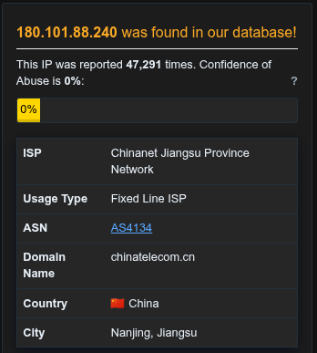

# Incident Response Report: SOC239 - Splunk Enterprise RCE (XSLT Injection)
**Incident ID**: SOC239 / EventID 201, **Date of Report**: "Dec 29, 2025", 
**Analyst**: Steven Razanajatovo, **Severity**: Critical, 
**Status**: Open (Containment Required), **Verdict**: True Positive

## Executive summary
On November 21, 2023, at 12:24 PM, the SOC detected an exploitation attempt against the **Splunk Enterprise** server (172.16.20.13). The alert indicated a Remote Code Execution (RCE) attempt via malicious XSLT file upload.

Investigation confirmed that an external attacker (`180.101.88.24`0) successfully uploaded a malicious XSLT file (`shell.xsl`) and executed arbitrary commands on the server. Post-exploitation activity was observed, including the creation of unauthorized user accounts. The incident is classified as a True Positive compromise requiring immediate server isolation and forensic cleanup.

## Incident overview
- **Alert Rule**: SOC239 - Remote Code Execution Detected in Splunk Enterprise

- **Event Time**: Nov 21, 2023, 12:24 PM

- **Target Host**: Splunk Enterprise (172.16.20.13)

- **Attacker IP**: `180.101.88.240`

- Device Action: Allowed

## Investigation timeline & analysis
### Source analysis
- **Attacker IP**: `180.101.88.240` (China, Chinanet).

- Reputation: The IP is flagged as malicious by 3/95 vendors on VirusTotal and reported over 47,000 times on AbuseIPDB, primarily for brute-force attacks.

### Exploit mechanism (XML/XSLT injection)
The attacker utilized a known vulnerability in Splunk Enterprise to upload a malicious XSLT stylesheet.

- **Vulnerable Endpoint**: `/en-US/splunkd/__upload/indexing/previe`w.

- **Payload**: The request uploaded a file named `shell.xsl` to `/opt/splunk/var/run/splunk/dispatch/...`.

- **Technique**: XSLT (Extensible Stylesheet Language Transformations) Injection allows an attacker to manipulate XML processing to execute code on the server-side.

### Post-exploitation & impact
Log analysis confirmed that the attack was **successful**. The following command execution was observed on the server around 12:00 PM:

- **Reconnaissance**: `whoami`, `groups`.

- **Persistence**: `useradd`, `passwd`.

- **Analysis**: The execution of `useradd` and `passwd` indicates the attacker successfully created a backdoor account to maintain access to the system.

## Indicators of Compromise (IOCs)
The following artifacts identify the attacker and their footprints.
|  Type | Value  |
|---|---|
| Attacker IP  | `180.101.88.240`  |
| File path  | `/opt/splunk/var/run/splunk/dispatch/1700556926.3/shell.xsl`  |
| Endpoint  | `/__upload/indexing/preview`  |
| Commands  | `whoami`, `useradd`, `passwd`  |

## Containment & remediation
- **Immediate Isolation**: The Splunk Enterprise server (172.16.20.13) must be disconnected from the network immediately.

- **Account Audit**: Identify and delete the user account created by the attacker during the useradd execution.

- **Forensics**: Image the server to preserve logs and potential backdoors installed by the attacker.

- **Cleanup**: Remove the `shell.xsl` file from the dispatch directory.

## Recommendations
1. **Patch Management**: Update Splunk Enterprise to the latest version immediately to mitigate the XSLT injection vulnerability (likely CVE-2023-46214).

- **Network Segmentation**: Ensure management interfaces (like Splunk web) are not exposed directly to the internet; restrict access to internal IPs or VPN only.

- **Privilege Management**: Run the Splunk service with the least privilege necessary, ensuring it does not have root permissions to create new system users easily.