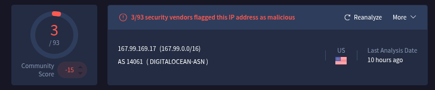

# Incident Response Report: SOC165 - SQL Injection Attempt
**Incident ID**: SOC165 / EventID 115, **Date of Report**: "Jan 14, 2026", 
**Analyst**: Steven Razanajatovo, **Severity**: High, 
**Status**: Closed (Failed Attempt), **Verdict**: True Positive

## Executive summary
On February 25, 2022, at 11:34 AM, the SOC received an alert (SOC165) regarding a potential SQL Injection (SQLi) attack against **WebServer1001** (172.16.17.18).

Investigation confirmed that an external attacker (`167.99.169.17`) attempted to inject a classic tautology-based SQL payload (`" OR 1 = 1`) into the search parameter of the web application. The application failed to process the query, returning an HTTP 500 error, indicating the injection was unsuccessful in retrieving data but likely caused a database syntax error. The incident is classified as a True Positive attempt with no data loss.

## Incident overview
- **Alert Rule**: SOC165 - Possible SQL Injection Payload Detected

- **Event Time**: Feb 25, 2022, 11:34 AM

- **Target Host**: WebServer1001 (172.16.17.18)

- **Attacker IP**: `167.99.169.17`

- **Device Action**: Allowed

## Investigation timeline & analysis
### Source analysis
- **Attacker IP**: `167.99.169.17` (US, Digital Ocean).

- **Reputation**: The IP is flagged as malicious by 3/93 vendors. Ownership by a cloud provider (Digital Ocean) typically indicates a compromised VPS or a disposable attack server.

- **User-Agent**: `Mozilla/5.0 (Windows NT 6.1; WOW64; rv:40.0)....` This is an outdated Firefox version (v40.1), suggesting the use of an automated scanning tool.

### Payload analysis
The attacker injected a standard SQL injection payload into the q (query) parameter.

- **Requested URL**: `https://172.16.17.18/search/?q=%22%20OR%201%20%3D%201%20--%20-`

- **Decoded Payload**: `" OR 1 = 1 -- -`

- **Intent**: This is a "Tautology" attack. The attacker attempts to close the original SQL statement with a quote (`"`) and append a condition that is always true (`OR 1=1`), followed by comments (`-- -`) to ignore the rest of the original query. The goal is to bypass authentication or retrieve all records from the database.

### Outcome & impact
- **Server Response**: Log analysis confirmed the server responded with an **HTTP 500 (Internal Server Error)**.

- **Command History**: No suspicious commands or further interaction were observed on the host command history.

- **Conclusion**: The HTTP 500 error indicates the application crashed or threw an exception when processing the malformed query, meaning the injection did not successfully return data. The attempt failed.

## Indicators of Compromise (IOCs)
The following artifacts identify the attacker.
| Type  | Value  | Context  |
|---|---|---|
| Attacker IP  | `167.99.169.17`  | SQL Injection sourece  |
|  Payload pattern | `%22%20OR%201%20%3D%201`  | SQL Injection signature  |

## Containment & remediation
- **Blocking**: Block the IP `167.99.169.17` at the firewall.

- **Code Review**: The fact that the application returned a 500 error suggests unhandled exceptions. The `/search/` endpoint code should be reviewed to ensure it uses "Prepared Statements" (Parameterized Queries) to treat user input as data, not code.

## Recommendations
1. **Input Sanitization**: Implement strong input validation to reject special characters (like quotes, dashes, or semicolons) in the search field if they are not necessary.

2. **Error Handling**: Configure the web server to return generic error messages (e.g., "An error occurred") rather than raw 500 errors, which might leak stack traces or database structure to an attacker.

3. **WAF Tuning**: Ensure the Web Application Firewall (WAF) is set to "Block" rather than just "Alert" for high-confidence SQL injection signatures.