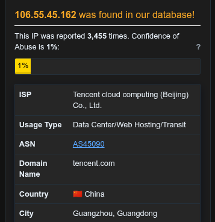
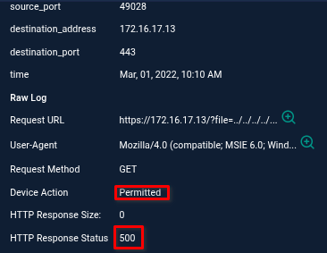

# Incident Response Report: SOC170 - Local File Inclusion (LFI) Attempt
**Incident ID**: SOC170 / EventID 120, **Date of Report**: "Jan 09, 2026", 
**Analyst**: Steven Razanajatovo, **Severity**: Medium, 
**Status**: Closed (Failed Attempt), **Verdict**: True Positive

## Executive summary
On March 01, 2022, at 10:10 AM, the SOC received an alert (SOC170) regarding a possible Local File Inclusion (LFI) attack against **WebServer1006** (172.16.17.13).

Investigation confirmed that an external attacker (106.55.45.162) attempted to exploit an LFI vulnerability by requesting the `/etc/passwd` file via directory traversal. However, the attack failed because the target server is running **Windows Server 2019**, which does not possess the targeted Linux system file. The server responded with an HTTP 500 error. The incident is classified as a True Positive attempt with no impact.

## Incident overview
- **Alert Rule**: SOC170 - Passwd Found in Requested URL - Possible LFI Attack

- **Event Time**: Mar 01, 2022, 10:10 AM

- **Target Host**: WebServer1006 (172.16.17.13)

- **Attacker IP**: `106.55.45.162`

- **Requested URL**: `https://172.16.17.13/?file=../../../../etc/passwd`

## Investigation timeline & analysis
### Source analysis
- **Attacker IP**: `106.55.45.162` (China).

- Reputation: The IP is highly malicious, reported over 3,455 times in AbuseIPDB.

- **User-Agent**: `Mozilla/4.0 (compatible; MSIE 6.0; Windows NT 5.1; .NET CLR 1.1.4322)`. This is a very old User-Agent (IE 6 on XP), suggesting the use of an automated scanning tool or legacy bot script.

### Payload & OS Mismatch
- **Payload**: `../../../../etc/passwd` is a classic LFI payload designed to traverse directories and read the password file on Linux systems.

- **Target OS**: The target **WebServer1006** is running `Windows Server 2019`.

- **Analysis**: Since Windows systems do not have an `/etc/passwd` file, this specific payload cannot succeed. This indicates the attacker is likely "spraying" exploits blindly without fingerprinting the target OS first.

### Outcome
- **Server Response**: Log analysis confirms the server returned an `HTTP 500 (Internal Server Error)`.

- **Conclusion**: The application likely failed to process the traversal path or the missing file, resulting in an error rather than file disclosure. The attack was unsuccessful.

## Indicators of Compromise (IOCs)
The following artifacts identify the attacker.
| Type  |  Value |  context |
|---|---|---|
| Attacker IP  | `106.55.45.162`  |  LFI Source |
| URL Pattern  | `/?file=../../../../etc/passwd`  | LFI Payload  |

## Containment & Remediation
- **Blocking**: Block the malicious IP `106.55.45.162` at the firewall to prevent further scanning or more targeted attacks.

- **Review**: Although this specific attack failed, the fact that the application accepts a `file=` parameter suggests it may be vulnerable to LFI if a valid Windows path (e.g., `C:\Windows\win.ini`) were used. The application code should be reviewed for input validation vulnerabilities.

## Recommendations
1. **Input Validation**: Implement strict input sanitization on the `file` parameter. Use an allow-list of permitted filenames and reject any input containing path traversal characters like `../` or `..\`.

2. **WAF Rules**: Configure the Web Application Firewall (WAF) to detect and block common LFI signatures (e.g., `/etc/passwd`, `win.ini`, `boot.ini`) in URL parameters.

3. **Error Handling**: Ensure the application fails gracefully. Returning a generic 404 or 403 error is preferable to a 500 error, which might leak stack trace information to an attacker.