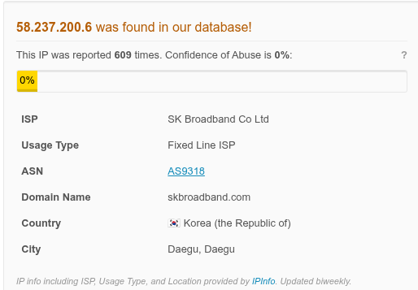

# Incident Response Report: SOC175 - Exchange Server Exploit Attempt (ProxyNotShell)
**Incident ID**: SOC175 / EventID 125, **Date of Report**: "Dec 27, 2025",
**Analyst**: Steven Razanajatovo, **Severity**: High,
**Status**: Closed (Blocked), **Verdict**: True Positive

## Executive summary
On September 30, 2022, at 07:19 AM, the SOC received an alert (SOC175) regarding a potential exploitation attempt against **Exchange Server 2** (172.16.20.8).

Investigation confirmed that an external attacker from a known malicious IP in Korea attempted to exploit the "ProxyNotShell" vulnerabilities (CVE-2022-41040/CVE-2022-41082). The attacker injected PowerShell commands into the `autodiscover.json` URL to achieve Remote Code Execution (RCE). The security device successfully blocked the request. The incident is classified as a True Positive exploitation attempt.

## Incident overview
- **Alert Rule**: SOC175 - PowerShell Found in Requested URL - Possible CVE-2022-41082 Exploitation

- **Event Time**: Sep 30, 2022, 07:19 AM

- **Target Host**: Exchange Server 2 (172.16.20.8)

- **Attacker IP**: `58.237.200.6`

- **Device Action**: Blocked

## Invesitigation timeline & analysis
### Source analysis
- **Attacker IP**: `58.237.200.6`(Korea, SK Broadband Co Ltd).

- **Reputation**: The IP was reported 609 times in AbuseIPDB, confirming it is a high-confidence threat actor.

- **User-Agent**: `Mozilla/5.0 zgrab/0.x`. This indicates the use of "ZGrab," an automated application layer scanner, suggesting this was part of a mass-scanning campaign.

### Payload analysis (ProxyNotShell)
The attacker utilized a specific URL structure known to target Microsoft Exchange Server vulnerabilities.

- **Request URL**: `/autodiscover/autodiscover.json?@evil.com/owa/&Email=autodiscover/autodiscover.json%3f@evil.com&Protocol=XYZ&FooProtocol=Powershell`

- **Vulnerability Context**: The URL attempts to chain **CVE-2022-41040** (Server-Side Request Forgery) to access the PowerShell backend, which is a prerequisite for **CVE-2022-41082** (Remote Code Execution).

- **Exploit Mechanics**: The inclusion of `Protocol=Powershell` and the `autodiscover.json` path are signatures of the "ProxyNotShell" exploit chain, which allows attackers to bypass authentication checks and execute PowerShell commands on the server.

### Outcome & Impact
- **Blocked**: The IIS log indicates the action was "Blocked," preventing the payload from reaching the backend application.

- **Attack Feasibility**: Successful exploitation of this chain generally requires the attacker to be authenticated. As the traffic originated from the internet without valid credentials, and was blocked, the attack was unsuccessful.

## Indicators of Compromise (IOCs)
The following artifacts identify the scanning/exploitation source.
| Type  | Value  | Context  |
|---|---|---|
| Attacker IP  | `58.237.200.6`  | Exploit Source (ProxyNotShell)  |
| User-Agent  | `Mozilla/5.0 zgrab/0.x`  | Scanner User-Agent  |
| URL Pattern  | /autodiscover/autodiscover.json  | Targeted Component  |
| Keyword  | FooProtocol=Powershell  | Exploit Signature  |

## Containment & remediation
- **Blocking:** The IP `58.237.200.6` should be permanently blocked at the perimeter firewall.

- **Verification**: Verify that the IIS logs on the Exchange Server do not show any `200 OK` responses for similar requests from this IP.

## Recommendations
1. **URL Rewrite Rules**: Implement the specific IIS URL Rewrite rules provided by Microsoft to mitigate CVE-2022-41040/41082 (blocking requests with `.*autodiscover\.json.*Powershell.*`).

2. **Patching**: Ensure the Exchange Server (running on Windows Server 2019) is patched with the cumulative security updates that address "ProxyNotShell".

3. **Geo-Blocking**: Since the traffic originated from Korea and the malicious IP reputation is high, consider geo-blocking regions where the organization has no business presence.