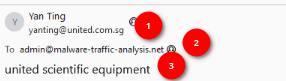
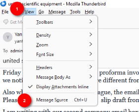
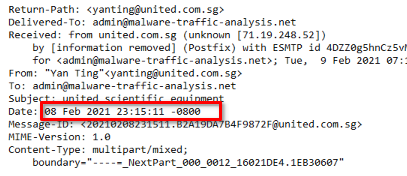
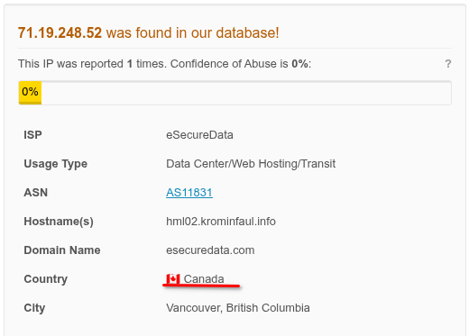
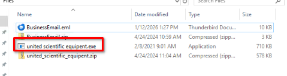
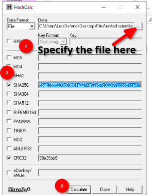
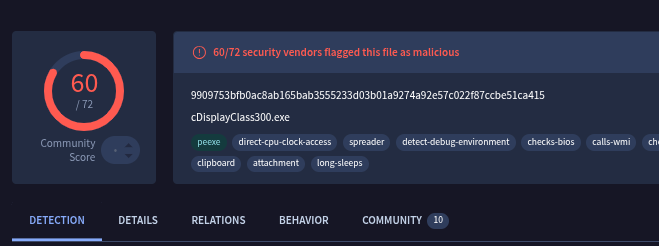

# Email analysis
> - **Type**: Phishing
> - **Focus**: Email analysis
> - **Tools**: Thunderbird, AbuseIPDB, HashCalc, VirusTotal

You recently received an email from someone trying to impersonate a company, your job is to analyze the email to see if it is suspicious.

**Initial task**: Unzip the 2 zip file in the Files directory on the Desktop.

## Q&A
1. What is the sending email address?
    - Open up the BusinessEmail.em in Thunderbird and look under the sender Name:

    

    - ***`yanting@united.com.sg`*** (1)
    - We also find here some other information like: *2 - recipient's mail address*, *3 - the mail's subject*.

2. What is the email address of the recipient?
    - ***`admin@malware-traffic-analysis.net`***

3. What date was the Email sent? Date format: MM/DD/YYYY
    - Still in Thunderbird, View the source of file by clicking on **View > Message Source**

    

    - Go down a little bit and find the date

    

    - ***`02/08/2021`***

4. What is the originating IP?
    - We see the originating IP in the previous screenshot in the Received entry.
    - ***`71.19.248.52`***

5. What country is the ip address from?
    - Let's use AbuseIPDB this time to analyze the previous IP address and find out from which country is it.
    - It came from ***`Canada`***

    

6. What is the name of the attachment when you unzip it? (with extension)
    - ***`united scientific equipent.exe`***

    

7. What is the sha256 hash of the File?
    - Let's open up the file with **HashCalc** and then calculate the SHA256 hash in it.

    

    - ***`9909753bfb0ac8ab165bab3555233d03b01a9274a92e57c022f87ccbe51ca415`***

8. Is the email attachment malicious? Yes/No
    - Based on VirusTotal report, it is malicious by 60/72 vendors.

    