# ICS Fuelstation (LetsDefend)
- **Type**: Threat hunting & network traffic analysis challenge
- **Focus**: Network analysis

## Description
Demonstrate your threat hunting and network traffic analysis skills by uncovering a C2 communications–related incident. On one of the organization’s critical endpoints, a suspicious file with an unusual extension was flagged by security tooling. Analyze the provided network traffic to trace the attacker’s activity and identify the threat.

## Q&A
1. The Attacker started off by scanning the subnet. When did port scanning activity start?
    - Unzip the file located at the machine's Desktop folder and open the pcapng file in Wireshark
    - Filter the packet with:  `tcp.flags & 0x02 || tcp.flags.fin ==1 && ip.src==10.10.32.130`
    
    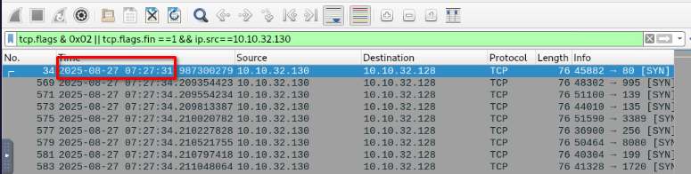
    
    - ***2025-08-27 07:27:31***

2. When did the port scanning activity stop?
    - Sorting the packet number from the previous filter in descendant order, we observe a large time gap between the packet No. 611 and 765, this would probably the switch of the scanning activity to another activity. Packet 611 marks the end of the scan so pick up its timedate.
    
    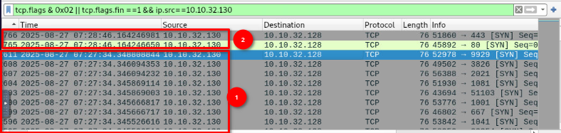
    - ***2025-08-27 07:27:34***

3. Please identify the IP Address of the internal asset used by the threat actor?
    - As we can see in the previous screenshot, we can assume the IP address of the internal asset used by the threat actor is ***`10.10.32.130`***.

4. Which port other than the tank gauge system was open on the system?
    - The best tool which fit here is NetworkMiner, it facilitates our duty by giving us some valuable insights about what was happening in the Network log. But, we have a slight problem, NetworkMiner doesn't support a pcapng file, so from the Wireshark, save the previous file as a pcap file format and then bring it to NetworkMiner.
    - We know which IP is our server, so click on ➕ sign next to `10.10.32.128` and see what are the opened ports in it.
    - Notice the hostname here, we need it in the upcoming question.
    
     

    - So here we are, there 2 ports opened in the system which are:
      - ***`21`***
      - 10001 (response to the next question)

5. Which port was being used by the ICS system?
    - ***`10001`***

6. Can you confirm the Vendor of the Automated tank gauge system being used on the field?
    - As we can observe in the previous screenshot, the 10001 port is not labeled to any service, so let's open Google and search for which service is running on it by default and see if whether it had a known vulnerability.
    - Upon searching on Google, I found this interesting article which presented the vulnerability discovered in ATS [here](https://www.bitsight.com/blog/critical-vulnerabilities-discovered-automated-tank-gauge-systems). Scrolling down in this page, I found a protocol: `Veeder-Root` running on the `10001` port and with a few research about this protocol, it was designed by `Veeder`.
    
    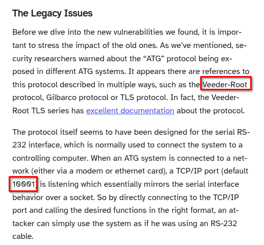 

    - ***`veeder`***

7. What is the Name of the petroleum pump that was being attacked?
    - From now on, we'll be focusing on TCP stream but before that, let's filter out the packet with wireshark filter: `tcp.port == 10001`
    - right click on the packet number 2773 and follow the TCP stream
    
    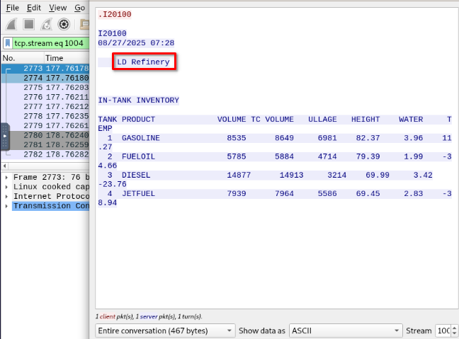

    - ***`LD Refinery`*** 

8. What is the function code used by the attacker for unauthorized access of data for delivery reports?
    - right click on the packet number 2799 and follow the TCP stream
    
    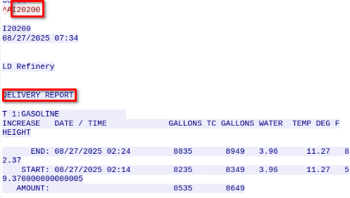

    - ***`I20200`***

9. At what time was a leak detected from one of the tanks?
    - Still on the same TCP  flow as the previous question, just go down and it'll show the server sending this message to the client:
      - LEAK DETECTED AT 03:14 AM

      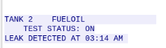

    - ***`03:14 AM`***

10. What was the status of the 1s product in the inventory?

    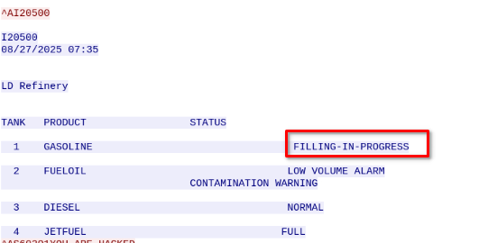

    - ***`FILLING-IN-PROGRES`***

11. The Attacker got access to the Delivery reports for the station. When was the time for the last delivery?

    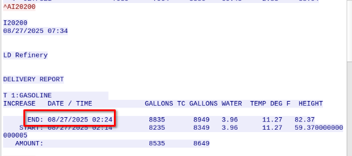

    - ***`08/27/2025 02:24`***

12. When did the attacker gain access to the site’s shift reports?

    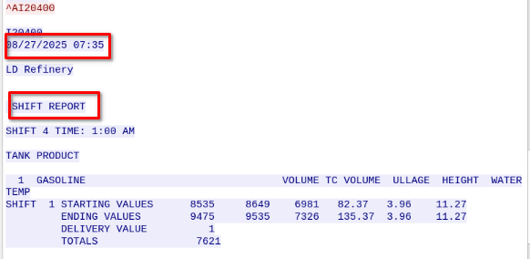

    - ***`2025-08-27 07:35`***

13. What was the temperature of the 2nd Gasoline product at the time of the incident?

    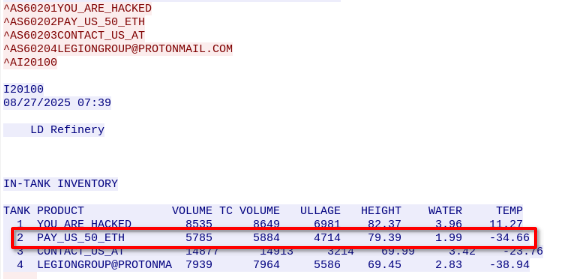

    - ***`-34.66`***
    - Notice the product name here which part of the ransome note, demanding the user to pay **50 ETH**

14. What is the name of the product in the Fourth tank?

    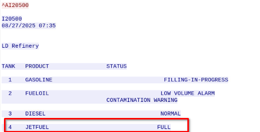

    - ***`jetfuel`***

15. What was the hostname of the machine running the tank gauge software?
    - Remember the hostname we found in the 4th question?
    - ***`LD-PETROLEUM-SITE-6`***

16. What was the email address associated with the attacker?

    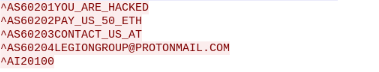
    
    - ***`legiongroup@protonmail.com`***