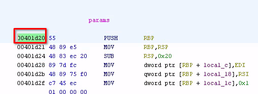
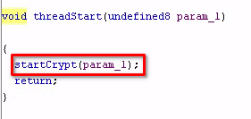
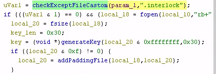
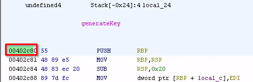
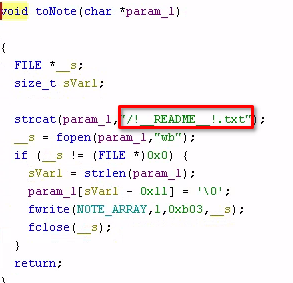
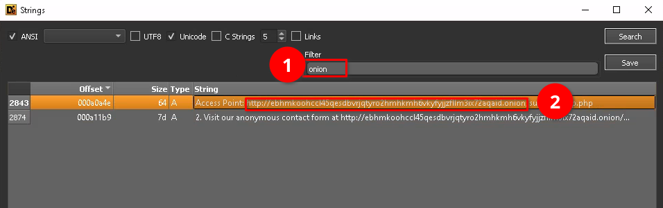

# Interlock Ransomware
> - **Type**: Digital Forensics
> - **Focus**: Malware analysis
> - **Tools**: Ghidra, Detect it Easy (DiE) 

Your Company has detected a ransomware infection on one of its Linux systems. This ransomware is designed to encrypt critical files and demand a ransom for their recovery, which significantly disrupts business operations. Once the system is infected, the ransomware scans for valuable data, including sensitive documents and configuration files, and encrypts them using a strong encryption algorithm.

## Questions and answers
1. What is the address of the function that handles the parameters executed by the ransomware?
   - **0x00401d20**
   - Open the malware sample in Ghidra and locate the main function. There is a function called params in it, then click and look at the first instruction, take note of the address.

2. After successfully encrypting a file, what extension did the ransomware add to it?
   - Upon analyzing the main function, we saw a function called threadStart, there was a function call: startCrypt() which might begin the encryption. Let's click on it and find what's inside.

    

   - inside startCrypt, we saw another function call `checkExceptFileCastom` that accept 2 parameters which are the param from the parent and a string “.*interlock”* and this is it.
   - **.interlock**

    

   - in this figure, we also see a function that generate the key used by the ransomware and the key length required for the operation.

3. What is the address of the function that generates the random key used by ransomware for encryption?
   -  Still inside the startCrypt, let's click on the `generateKey` function and see in which address it is located.
   -  **0x00402c80**

    

4. Which API was used to move the file pointer to the end of the file in the function that adds padding to the files?
   - As we go down in the startCrypt function, we see a call to `addPaddingFile` function which might add padding to the files as its name says. Let's click on it and see what API it calls to move the file pointer to the end of the file.

    

   - As we can see, the **fseeko** function has been called to move the file pointer to the end of the file.
   - **fseeko**()

5. What value is used to retrieve the last four bits of the "fileSize" in the function that creates padding for files?
   - **0xf**
   - It's obvious and verified in the previous screenshot. There is an AND logic operation in the addPaddingFile function which operate the file bytes size and 0xf to retrieve the 4 last bits of the fileSize.

6. What is the key length used for RSA encryption in the "startCrypt" function, represented in hexadecimal?
   - **0x30**
   - We see that in the startCrypt function, just before the key generation.

7. What is the name of the ransomware note created by the toNote function ?
   - Let's search the toNote function by using the symbol tree tab in Ghidra

    
    

  - click toNote and there we are, **/!README!.txt**

8. What is the TOR ransomware link mentioned in the ransomware note?
   - let's open the malware in DiE (Detect it Easy), go to the strings tabs and search for onion and that's it.

    

  - `http://ebhmkoohccl45qesdbvrjqtyro2hmhkmh6vkyfyjjzfllm3ix72aqaid.onion`