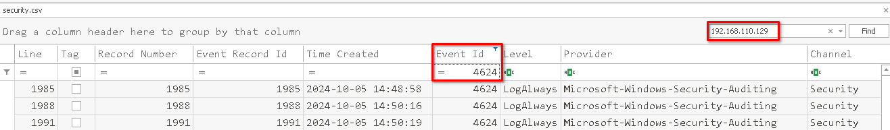
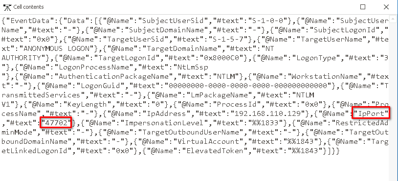
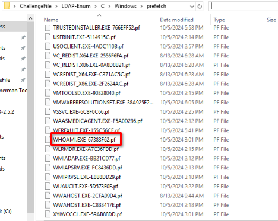
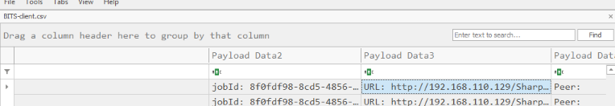
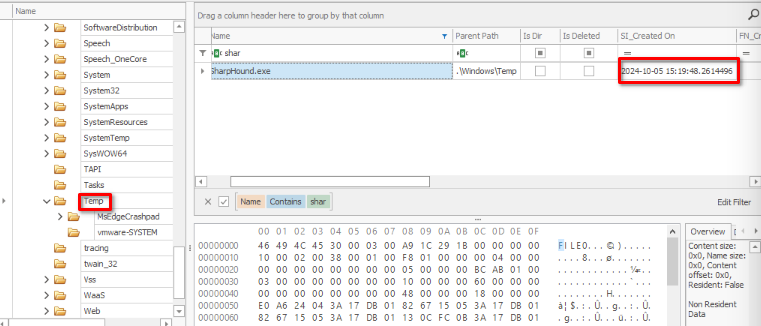
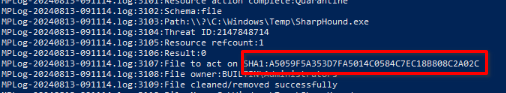
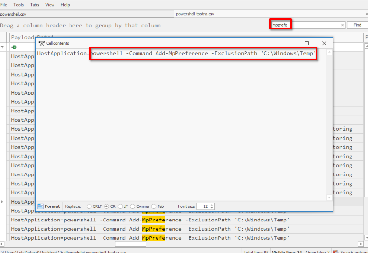
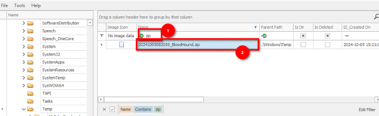
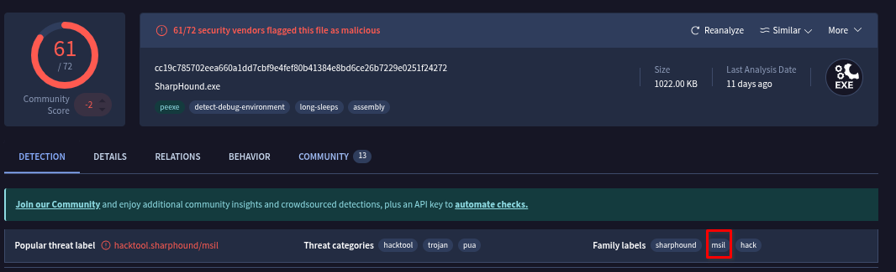
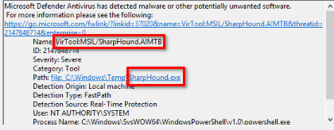

# LDAP Enumeration
> - Type: Threat hunting and DFIR challenge
> - Focus: Windows forensics
> - Tools: EvtxCmd, TimelineExplorer, Powershell, MFT Explorer, Event Viewer, Virustotal

A network has been breached, and an alert was triggered indicating suspicious network enumeration activities from IP **192.168.110.129**. Initial indicators suggest an attacker inside the network is actively probing systems and gathering information about critical assets. You are tasked with tracing the attacker's movements to determine the source of the anomaly, understand how the attacker gained access, and assess what actions they might have taken inside the network.

## **Q&A**
1. The investigator needs to determine when the attacker first accessed the system. Based on the login records, when did the first successful login from the malicious IP occur?
    - Let's convert the `security.evtx` present in the challenge folder to CSV using **EvtxeCmd** from <u>Zimmermann Tools</u>
    ```
    EvtxECmd.exe -f "C:\Users\LetsDefend\Desktop\ChallengeFile\LDAP-Enum\C\Windows\System32\winevt\logs\Security.evtx" --csv C:\Users\LetsDefend\Desktop\ChallengeFile --csvf security.csv
    ```
    - Open the `security.csv` with TimelineExplorer and filter the log with: **EventID=4624** and **raw logs contain 192.168.110.129**
    - ***`2024-10-05 14:48:58 UTC`***

    

2. What is the port number used for the previous login?
    - Click the **Payload** of the previous entry and find it in the **ipPort** by filtering it by **port**
    - ***`47702`***

    

3. Once inside the system, it seems the attacker immediately began gathering information. What was the first command they executed?
    - Investigating the windows log file didn't help us so let's use another approach. We can use the prefetch directory in the C:/Windows/prefetch and analyze which command related to information gathering is there. 
    - ***`whoami`***
    - <u>**Note**:</u> prefetch files on Windows are small optimization files that Windows creates the first time you run a program. They store information about how the app starts so Windows can load it faster next time. They’re located in C:\Windows\Prefetch, managed automatically by the system, and normally shouldn’t be deleted.

        

4. During the attack, the attacker downloaded a malicious file. What is the exact URL of the file?
    - We saw a **BITS client** installed on the machine by listing all the log files present on the **winevnt** folder from the artifacts and it made us curious because BITS (Background Intelligent Transfer Service) is used to download files in the background, using idle bandwidth.
    - So let's parse the BITS client's evtx file to csv and then analyze it with TimelineExplorer again.
    - Filter the csv file with **Event ID=59** (Job started)
    ```
    EvtxECmd.exe -f "C:\Users\LetsDefend\Desktop\ChallengeFile\LDAP-Enum\C\Windows\System32\winevt\logs\Microsoft-Windows-Bits-Client%4Operational.evtx" --csv C:\Users\LetsDefend\Desktop\ChallengeFile\ --csvf BITS-client.csv
    ```

    - ***`http://192.168.110.129/SharpHound.exe`***

    

5. The download logs indicate when the malicious file was brought onto the system. What time did the download occur?
    - The BITS client from earlier just provided the job start's timestamp but not the real exact time when the file was written to the file system. By verifying the Temp folder, we saw nothing, despite this is the ideal place where threat actor usually put their file after download. So, let's analyze the MFT table which might uncover some deleted files and maybe we would see our previous malware file. 
    - This time, we used **MFT Explorer** and opened the `$MFT` file from the artifacts, it took a little bit long to fully parse the file, but that was fine.
    - And boom, it was there, deleted but still recorded in the MFT table.
    - ***`2024-10-05 15:19:48`***

    

6. Windows Defender detected the malicious file and generated an alert. What is the SHA1 hash of this file?
    - By analyzing the windows defender logs from event viewer, it showed the malware being detected (**Event ID: 1116** ) but the file hash was missing. So let's investigate the Windows Defender log (Mplog) which captured the most details about the malware scanning. It is located in: *C:\ProgramData\Microsoft\Windows Defender\Support* folder.
    - Once inside the previous directory: select only the log entry that contains **“SharpHound.exe”** using this powershell command:
        ```
        Select-String -Path "MPLog-*.log" -Pattern "SharpHound.exe" -Context 5,5
        ```
    - ***`A5059F5A353D7FA5014C0584C7EC18B808C2A02C`***

    

7. To evade detection, the attacker excluded a specific directory from the Defender scan. What command did they use to do so?
    - First of all, adjusting the Defender parameters with command line is usually done with ***-MpPreference** so let's filter out our event log.
    - By investigating the Microsoft Windows Powershell Operational event log, we saw a long script which contains our filter but it doesn't reveal the actual command we search for. Let's verify the other Windows Powershell event log because maybe the actor ran the powershell directly in *cmd.exe, scheduled task or run key* and the parameter would be recorded in the legacy powershell event log.
    - Let's convert the event log file to CSV againg and then open it in TimelineExplorer
    ```
    EvtxECmd.exe -f 'C:\Users\LetsDefend\Desktop\ChallengeFile\LDAP-Enum\C\Windows\System32\winevt\logs\Windows PowerShell.evtx' --csv C:\Users\LetsDefend\Desktop\ChallengeFile\ --csvf powershell-tsotra.csv
    ```

    

    - ***`powershell -Command Add-MpPreference -ExclusionPath 'C:\Windows\Temp'`***

8. After executing the malicious file, a zip file was created on the system. What is the full path of this zip file?
    - Let's re-investigate the MFT table again because it may record any other files. Filter out the Name column with zip and there you go

    

    - ***`C:\Windows\Temp\20241005082055_BloodHound.zip`***

9. What is the malware family name associated with the malicious file that was downloaded?
    - Analyze the SHA1 hash we got previously in this task in Virustotal.

    

    - ***`msil`***

10. What is the malware signature detected by Windows Defender for the malware?
    - We see this in the Windows Defender event log by filtering it with **EventID=1116**.

    

    - ***`VirTool:MSIL/SharpHound.A!MTB`***