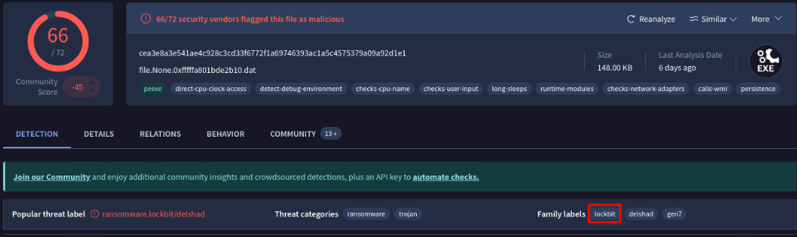
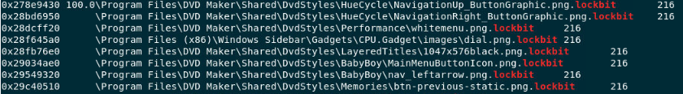

# LockBit Ransomware: A Memory Forensics Case Study
> - **Type**: Threat hunting, Threat intelligence
> - **Focus**: Malware analysis
> - **Tools**: VirusTotal

## Introduction
Ransomware remains one of the most disruptive threats facing organizations today. In this case study, we analyze a **LockBit ransomware infection** using memory forensics and threat intelligence techniques. By examining a compromised Windows memory image, we uncover how the ransomware executed, persisted, and encrypted files on the victim system.

This walkthrough highlights practical investigation steps and maps attacker behavior to industry-standard frameworks such as MITRE ATT&CK.

## Initial infection and timeline
The first objective was identifying *when* the system became infected. Memory analysis revealed that the malicious process was created on:
 **2023-04-13 10:06:45 UTC**.
 
This timestamp corresponds to the execution of the ransomware process (`mal.exe`) found in the system’s running process list. Process creation time is a reliable indicator of initial compromise during memory-based investigations

## Identifying the Ransomware
Once the suspicious process was identified, its executable was extracted directly from memory for further inspection. Analysis confirmed the malware family as **LockBit**, one of the most active ransomware groups in recent years.

VirusTotal detection results showed a high confidence malicious verdict, supported by behavioral indicators consistent with ransomware activity, including file encryption and registry modification

## Encryption activity
A key confirmation of ransomware behavior is encrypted file output. The analysis revealed that the malware appended the following extension to encrypted files:

`.lockbit`

Numerous system and application files were found renamed with this extension, validating that the ransomware successfully executed its encryption routine across the host

## Ransom note discovery
LockBit dropped a ransom note named: `Restore-My-Files.txt`.
Although extracting the file directly from memory proved difficult, the file hash was identified through threat intelligence correlation. The SHA-256 hash of the ransom note is: `67c6784a5296658ac4d633f4e8c0914ecc783b1cf2f6431818c4e2f3cdcce91f`.
This note serves as the attacker’s primary communication channel, instructing the victim on payment and recovery options

## Persistence mechanism
To ensure it survived reboots, the ransomware modified a Windows autorun registry key. The following registry value was added:
- **Registry Key Name**: XO1XADpO01

- **Path**:
HKU\...\Software\Microsoft\Windows\CurrentVersion\Run\XO1XADpO01

This technique allows the ransomware to automatically execute whenever the affected user logs in, maintaining long-term access to the system

## Privilege escalation and MITRE ATT&CK mapping
Behavioral analysis showed that LockBit leveraged a persistence-related privilege escalation technique mapped to:

- **MITRE ATT&CK ID: T1543 – Create or Modify System Process**

Mapping observed behaviors to MITRE ATT&CK helps defenders understand attacker tactics and improves detection and response strategies across environments

## Key Indicators of Compromise (IOCs)
- File Hash (Ransomware Executable – SHA-256): `19ca5aa4cd62929afb255d2b38e70fd3143e3b181889e84348a5c896e577d708
`

- TLSH (Trend Micro Locality Sensitive Hash):
`T119E3163DB459E165C8CF04B57E2516BAD671F83C037989F3EBD38C299420EE86626B07`

- Encrypted File Extension: `.lockbit`

- Ransom Note: `Restore-My-Files.txt`

## Final thoughts
This investigation demonstrates how effective memory forensics can be when analyzing ransomware incidents. Even when disk artifacts are limited or encrypted, volatile memory can reveal execution timelines, malware identity, persistence mechanisms, and critical indicators of compromise.

LockBit continues to be a highly operational ransomware family, making early detection, behavioral monitoring, and robust backup strategies essential for modern defensive security programs.