# Threat Hunting with Splunk
> - **Type**: Threat hunting & Incident Response challenge
> - **Focus**: C2 communication
> - **Tools**: Splunk

Demonstrate your Splunk threat hunting skills and uncover a C2 communications related incident. A security tool alerted on a suspicious file with an anomalous extension. Hunt through Splunk logs to uncover C2 communication and attacker activities.

## Add data from uploaded logs
Go to Settings > Add Data

Select "Upload" in the bottom left corner

Press Next if everything is okay

Press "All Fields" from the left, then choose all filters.

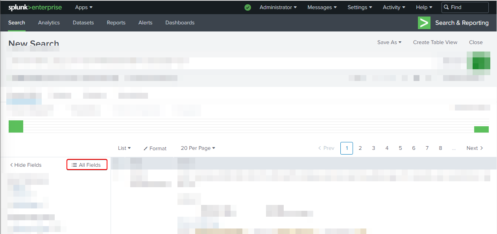

Select all available filters

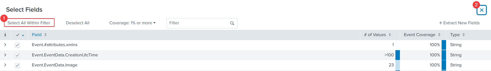

Download the [data file](https://ld-bo-files.s3.us-east-2.amazonaws.com/splunk+challenge/Splunk-sysmon.7z), extract it and upload it to Splunk. You'll use this data for other questions, don't skip this part.

## Q&A
> **Note**: all the filters given here are SPL query. 
1. What is the full path of the file that likely provided remote access?
    - Let's check the event for network connection in the file system by filtering the sysmon log with **Event ID = 3** to check if which files are providing remote access.
    - Filter: `source="sysmon.json" host="ip-172-31-9-191.us-east-2.compute.internal" sourcetype="_json" "Event.System.EventID"=3`

    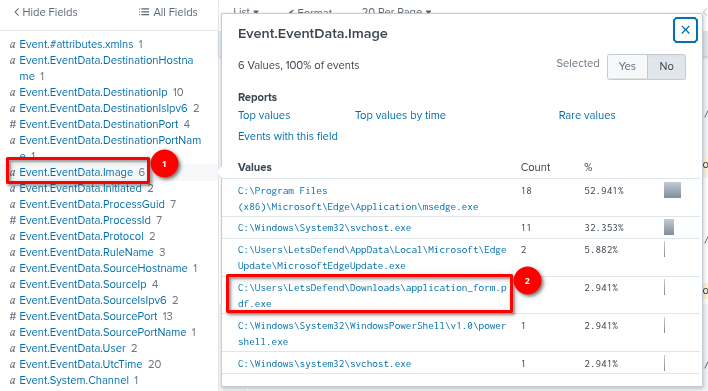

    - ***`C:\Users\LetsDefend\Downloads\application_form.pdf.exe`***

2. When was this file created on the disk?
    - This time, let's look at the creation time of the file by filtering the sysmon log with **Event ID = 11**
    - Filter: ***`Event.System.EventID="11" "application_form.pdf.exe"`***

    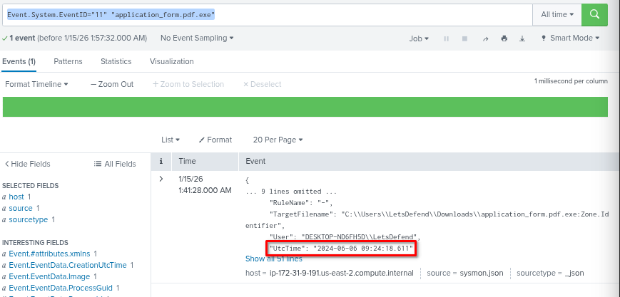

    - ***`2024-06-06 09:24:18`***

3. What URL was the file downloaded from?
    - We can find the URL where the file was downloaded in the file create stream hash event log which can be found in **Event ID 15**
    - Filter: ***`Event.System.EventID="15" "application_form.pdf.exe"`***
    - ***`http[://]13.232.55.12:8080/application_form.pdf[.]exe`***

    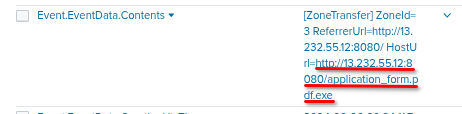

4. What is the IP and port used for C2 Communication? Format (IP:PORT)
    - As we see in the previous answer, the attacker downloaded the file from `13.232.55.12`, let's verify if it is also the server for C2 com.
    - Filter: ***`Event.System.EventID="3" "application_form.pdf.exe"`***

    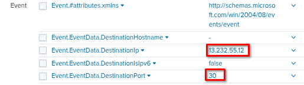

    - and yes, it is
    - ***`13.232.55.12:30`***

5. The trojan executed cmd and started a command prompt session. When did this activity occur?
    - Let's filter out the log by process creation containg our filename and see at what time it executed Cmd.exe
    - Filter: ***`Event.System.EventID="1" "application_form.pdf.exe" | table Event.EventData.OriginalFileName, Event.EventData.ParentImage, Event.EventData.UtcTime`***

        

    - ***`2024-06-06 09:28:55`***

6. What was the second command executed by the attacker using the cmd session?
    - From the previous filter, we can take note the Logon ID of the cmd session and use it in the next filter.
    - **LogonId**: 0x1855c
    - filter: `Event.System.EventID="1" "cmd.exe" Event.EventData.LogonId="0x1855c" | table Event.EventData.UtcTime, Event.EventData.OriginalFileName, Event.EventData.ParentImage`

    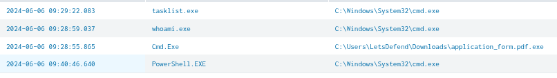   

    - From this screenshot, just after the Cmd command, the attacker executed 3 commands, the first is whoami, then tasklist and powershell.
    - ***`tasklist`***

7. The attacker has added a new user to the system to establish persistent access. What is the username/password pair for the newly created account?
    - Let's filter out the commandline with any commands containing the word **net** because it is the common way that many administrators/attackers use to create new user in Windows system.
    - filter: `Event.System.EventID="1" Event.EventData.CommandLine="*net*" | table Event.EventData.CommandLine`

    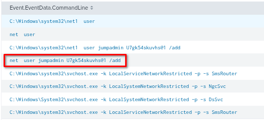

    - ***`jumpadmin:U7gk54skuvhs@1`***

8. The attacker downloaded a script for further post-exploitation. What is the full path to the script on the local system?
    - Let's filter out all the image filenames containg the extension (.ps1) in the file creation event log (EventID=11)
    - Filter: `Event.System.EventID="11" "*ps1" | table Event.EventData.TargetFilename`

    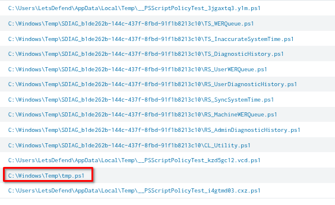

    - ***`C:\Windows\Temp\tmp.ps1`***

9. The logs also show Powershell activity. When did the attacker bypass the Powershell execution policy on the system?
    - Filter: `Event.System.EventID="1" "powershell.exe" "bypass" | table Event.EventData.CommandLine, Event.EventData.UtcTime`

    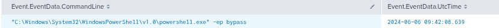

    - ***`2024-06-06 09:42:08`***

10. To stop the attacker's activity, our system administrator changed the firewall rules on the system immediately after the security team received an alert. What was the name of the rule that was added?
    - This time, let's check the registry event (**Event ID = 13**) that may contains the **firewallrules** keyword in it.
    - Filter: `Event.System.EventID="13" "*firewallrules*"`

    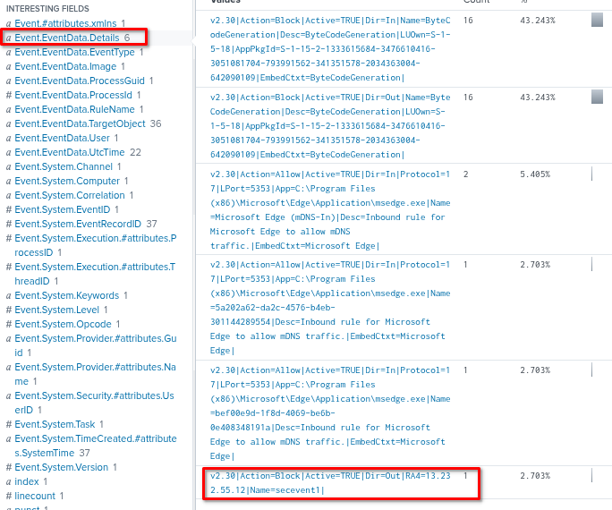

    - ***`secevent1`***

11. What was the user context/permissions that enforced the policy/rule?
    - Click on the previous details then splunk will add it as filter.
    -  Filter: `Event.System.EventID="13" "*firewallrules*" "Event.EventData.Details"="v2.30|Action=Block|Active=TRUE|Dir=Out|RA4=13.232.55.12|Name=secevent1|"`

    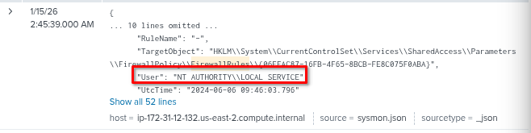

    - ***`NT AUTHORITY\LOCAL SERVICE`***